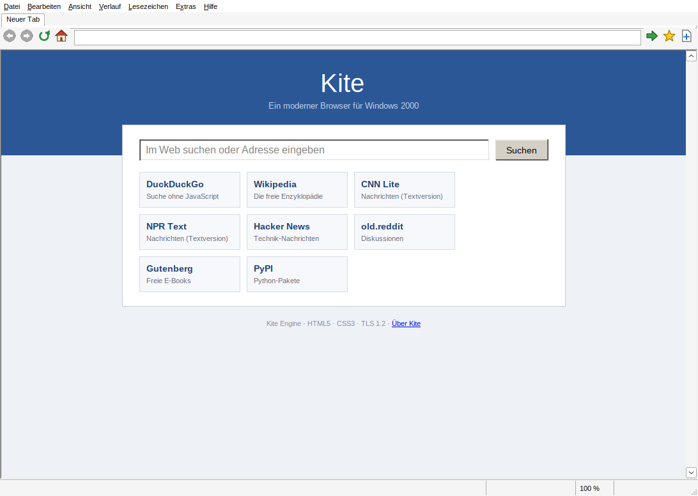
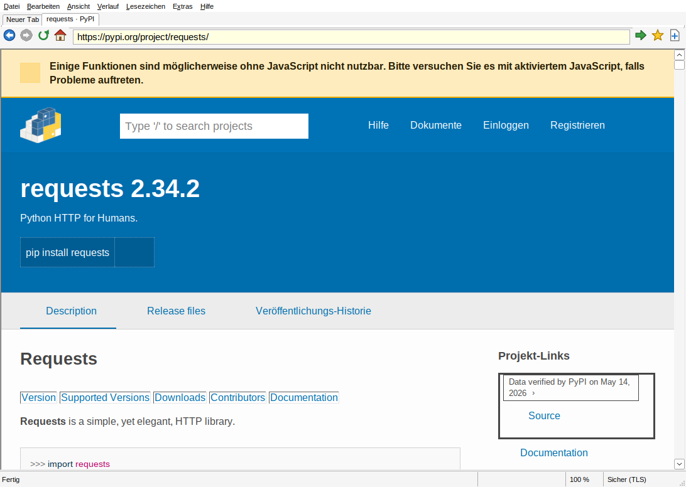
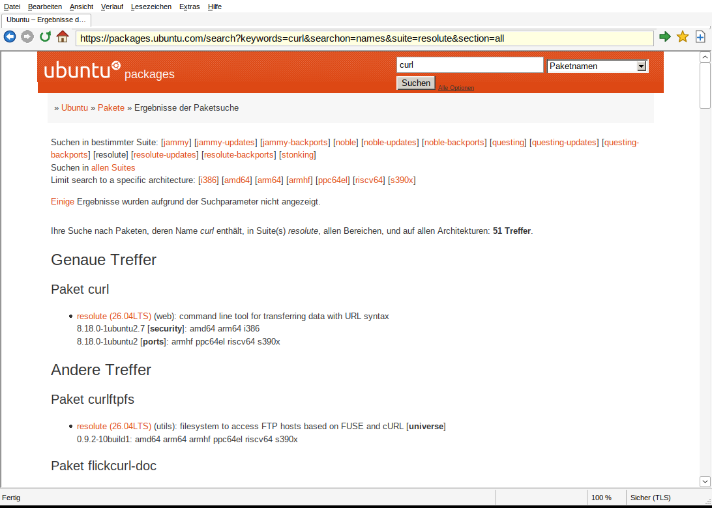

# Kite – ein moderner Webbrowser für Windows 2000


Kite ist ein Webbrowser mit **eigener, in C++ geschriebener Rendering-Engine**,
der unter **Windows 2000** (und allen späteren Windows-Versionen) läuft. Er
bringt das heutige Web – HTTPS mit TLS 1.3, modernes CSS mit Flexbox, Grid,
CSS-Variablen und SVG – auf ein Betriebssystem aus dem Jahr 2000, ohne auf
den Internet Explorer oder Systembibliotheken angewiesen zu sein.



## Funktionen

**Browser**

- Tabs (Strg+T, Strg+W, Strg+Tab), Adressleiste mit Suche, Zurück/Vor, Startseite
- Lesezeichen (Strg+D), Verlauf, Zoom (Strg +/−/0, Strg+Mausrad)
- Suchen auf der Seite mit Hervorhebung (Strg+F, F3)
- Formulare: Textfelder, Passwörter, Textbereiche, Checkboxen, Radiobuttons,
  Auswahllisten, Absenden per GET und POST
- Text markieren und kopieren, Kontextmenü (Link in neuem Tab, Link kopieren,
  Bild speichern …)
- Downloads mit „Speichern unter“, Seitenquelltext (Strg+U), Seite speichern
- Cookies (dauerhaft gespeichert), HTTP-Proxy, einstellbare Suchmaschine
- JavaScript (abschaltbar unter Extras → Einstellungen), JavaScript-Konsole
  (Strg+Umschalt+J), `alert`/`confirm`/`prompt` als Windows-Dialoge
- Portabel: Einstellungen liegen in `kite.ini` neben `kite.exe`

**Engine („Kite Engine“)**

| Bereich | Umfang |
|---|---|
| HTML | HTML5-Tokenizer und Tree-Builder mit Fehlerkorrektur, Zeichenreferenzen, Zeichensatz-Erkennung (UTF-8, Windows-1252, ISO-8859-1/-15, UTF-16) |
| CSS | Kaskade mit Spezifität und `!important`, Selektoren bis Level 4 (`:is()`, `:where()`, `:not()`, `:has()`, `:nth-child()`, Attributselektoren …), `@media` (inkl. Bereichs-Syntax), `@supports`, `@import`, `@layer`, CSS-Verschachtelung, Custom Properties (`var()`), `calc()`/`min()`/`max()`/`clamp()`, `::before`/`::after` |
| Layout | Block- und Inline-Formatierung mit Zeilenumbruch, Margin-Collapsing, Floats und `clear`, Tabellen (colspan/rowspan, automatische Spaltenbreiten), **Flexbox**, **Grid** (Spalten, `repeat()`, `fr`, `minmax()`, `auto-fill`), relative und absolute Positionierung (`fixed` vereinfacht), `overflow`-Clipping, Listen |
| Grafik | Hintergründe und Hintergrundbilder, Rahmen (inkl. klassischem 3D-Look), abgerundete Ecken, `box-shadow`, Transparenz, **2D- und 3D-Transformationen** (`translate`, `rotate`, `scale`, `skew`, `matrix`, `rotateX/Y`, `rotate3d`, `translateZ`, `matrix3d`, **`perspective`** und `perspective-origin`, `transform-style: preserve-3d` mit Tiefensortierung, `backface-visibility`, `transform-origin`, Einzeleigenschaften `rotate:`/`scale:`), PNG/JPEG/GIF/BMP/**WebP**/**AVIF** (auch `<picture>`; **animierte GIF, WebP und AVIF** werden abgespielt), **SVG** (Inline und als Bild, mit Kantenglättung, Verläufen, Masken und Clip-Pfaden) |
| Animation | **CSS-Animationen** (`@keyframes`, alle `animation-*`-Eigenschaften, Timing-Funktionen inkl. `cubic-bezier()`/`steps()`) und **Transitions** für Deckkraft, Farben, Transformationen (auch Drehung und Skalierung), Schatten, Größen und Abstände; `animationend`/`transitionend`-Events |
| Canvas | **`<canvas>` 2D** per Software-Rasterizer: Pfade, Bögen, Füllregeln, Linienstile und Strichelung, Transformationen, Clipping, lineare/radiale/konische Verläufe, Muster, Compositing-Modi, Schatten, Text, `drawImage`, `getImageData`/`putImageData`, `toDataURL`, `Path2D` |
| Audio/Video | **`<video>` und `<audio>`** mit H.264, HEVC, VP8, VP9, Theora sowie AAC, MP3, Opus, Vorbis, FLAC und PCM in MP4, WebM/Matroska, Ogg, MP3, WAV und FLAC; Laden in Stücken per HTTP-Range-Anfragen mit Vorpuffer, Spulen, Schleife, Poster, eingebaute Bedienleiste (`controls`), stummes Autoplay; Tonausgabe über waveOut; vollständige `HTMLMediaElement`-API (`play()`-Promise, `currentTime`, `duration`, `buffered`, `volume`, `muted`, `canPlayType()`, Events von `loadedmetadata` bis `ended`, `new Audio()`) |
| Schriften | **Webfonts** (`@font-face`, TTF/OTF/WOFF/WOFF2) werden geladen und prozesslokal installiert |
| JavaScript | **QuickJS** (ES2023) mit eigener DOM-Anbindung: `document`/`window`, Elemente, `querySelector`, `innerHTML`, `classList`, `style`, `dataset`, Events mit Bubbling und `preventDefault`, Timer, `requestAnimationFrame`, `fetch`, `XMLHttpRequest`, `localStorage`/`sessionStorage` (dauerhaft gespeichert), **ES-Module** (`type=module`, Import-Maps, dynamisches `import()`), `MutationObserver`, History-API (`pushState`, `popstate`), **Web Components** (Custom Elements mit Lebenszyklus-Callbacks, **Shadow DOM** mit Slots, gekapselten Styles, `:host`, `::slotted()`), `TreeWalker`, **Web Worker** (auch Modul-Worker), **WebSockets**, `Intl` (Zahlen, Datum, Plural, Listen, relative Zeiten), Streams (`ReadableStream`/`WritableStream`/`TransformStream`), `Blob`/`FileReader`/`FormData` mit Binärdaten, `crypto.getRandomValues`/`randomUUID`/`subtle.digest`, `structuredClone`, `URL`, `document.cookie`, `getBoundingClientRect`/`getComputedStyle`, `<noscript>` |
| Netzwerk | HTTP/1.1, **HTTP/2** (ALPN, Multiplexing über eine Verbindung pro Server, HPACK, Flusskontrolle), **TLS 1.3** (eigene Implementierung: ChaCha20-Poly1305, AES-GCM, X25519/P-256, RSA-PSS/ECDSA) und **TLS 1.2** (BearSSL) mit Zertifikatsprüfung, gzip/deflate/Brotli, Weiterleitungen, Cookies, Proxy (CONNECT, lokale Adressen direkt), **WebSockets** (`ws:`/`wss:`), `data:`- und `file:`-URLs |





## Was (noch) nicht geht

- JavaScript: WebGL fehlt; `Intl` kennt die gängigen
  europäischen Sprachen, Zeitzonen außer UTC und der lokalen werden nicht umgerechnet. Große Single-Page-Anwendungen (React, Angular …)
  laufen daher oft nur teilweise.
- Video: kein AV1, kein adaptives Streaming (Media Source Extensions, HLS,
  DASH) und keine DRM – YouTube & Co. spielen daher nicht ab, eingebettete
  MP4/WebM-Dateien dagegen schon. `playbackRate` wird ignoriert; die
  Dekodierung läuft in Software auf einem Kern, auf alten Rechnern sind daher
  eher SD-Videos flüssig (zu späte Bilder werden ausgelassen).
- 3D-Szenen werden ebenenweise nach Tiefe sortiert, sich durchdringende Flächen
  werden nicht geschnitten; HDR-Tonemapping für AVIF fehlt.
- HTTP/2 lässt sich mit `Http2=0`, TLS 1.3 mit `Tls13=0` in der `kite.ini` abschalten.
- Windows 2000 bringt nur begrenzte Unicode-Schriften mit; Emoji und manche
  Schriftsysteme erscheinen als Kästchen.

## Installation unter Windows 2000

1. `kite.exe` und `cacert.pem` (Stammzertifikate) in denselben Ordner kopieren.
2. `kite.exe` starten. Eine Installation oder weitere DLLs sind nicht nötig –
   die Datei ist vollständig statisch gelinkt und benötigt nur Bibliotheken,
   die zu Windows 2000 gehören.
3. **Wichtig:** Datum und Uhrzeit des Systems müssen stimmen, sonst schlägt die
   Zertifikatsprüfung bei HTTPS-Seiten fehl.

Empfohlen: Windows 2000 mit Service Pack 4 und mindestens 128 MB RAM; große,
moderne Seiten profitieren deutlich von einem schnellen Prozessor.

## Bauen

Gebaut wird mit MinGW-w64 als Cross-Compiler, z. B. unter Linux:

```sh
sudo apt install cmake g++-mingw-w64-i686 nasm   # Debian/Ubuntu
./build-win2k.sh                                  # Ergebnis: dist/Kite/kite.exe
```

`build-win2k.sh` lädt beim ersten Mal die FFmpeg-Quellen (4.4.2, SHA-256
geprüft) und baut daraus mit `tools/build-ffmpeg.sh` nur die benötigten
Decoder als statische Bibliotheken (`third_party/ffmpeg/`, einige Minuten).
Mit `KITE_NO_FFMPEG=1 ./build-win2k.sh` entsteht ein Kite ohne
Medienwiedergabe.

Unter Windows funktioniert dasselbe mit MSYS2 (Umgebung „MINGW32“):

```sh
pacman -S mingw-w64-i686-gcc mingw-w64-i686-cmake make
cmake -S . -B build-win -G "MSYS Makefiles" -DCMAKE_BUILD_TYPE=Release
cmake --build build-win
```

`tools/check-win2k-imports.sh` prüft nach dem Bauen, dass die EXE keine
Windows-API importiert, die es unter Windows 2000 nicht gibt. Neuere
MinGW-Laufzeiten verwenden einige Vista-Funktionen (Condition Variables,
`GetThreadId`); für diese enthält `src/win32/compat.c` Ersatzimplementierungen.

Die GitHub-Actions-Pipeline (`.github/workflows/build.yml`) baut bei jedem
Push automatisch `kite.exe` und stellt sie als Artefakt bereit.

### Engine-Tests und Werkzeuge (Linux/macOS)

Die Engine ist plattformunabhängiges C++11 und lässt sich auch nativ bauen:

```sh
sh tools/build-ffmpeg.sh native                   # optional: Mediendecoder
cmake -S . -B build-linux && cmake --build build-linux
./build-linux/kite-tests                          # Unit-Tests
./build-linux/kite-dump --width 1024 seite.html   # Box-Baum ausgeben
./build-linux/kite-dump https://example.org --ppm vorschau.ppm
./build-linux/kite-dump --js https://example.org  # mit JavaScript
```

## Aufbau des Quellcodes

```
src/engine/            plattformunabhängige Engine (C++11)
  base/                Strings, UTF-8, Geometrie, Mutex
  html/                Tokenizer, Tree-Builder, Zeichenreferenzen
  dom/                 Dokumentmodell
  css/                 CSS-Parser, Eigenschaften, Kaskade, UA-Stylesheet
  layout/              Box-Baum, Block/Inline, Floats, Tabellen, Flex, Grid
  paint/               Display-List und Painter
  image/               PNG/JPEG/GIF (stb_image), WebP, SVG und gemeinsamer
                       Vektor-Rasterizer (raster.cpp)
  canvas/              <canvas>-2D-Kontext
  media/               <audio>/<video>: Datenquelle mit Range-Anfragen,
                       Decoder-Thread (FFmpeg), Farbkonvertierung, Takt
  net/                 URL, Sockets, TLS (BearSSL), HTTP, Cookies
  script/              JavaScript: QuickJS-Anbindung (script.cpp) und
                       Web-API in JavaScript (dom_js.cpp)
  text/                Webfont-Konvertierung (WOFF/WOFF2 → TrueType)
  page/                Seite: verbindet DOM, Styles, Layout, Skripte und Painting;
                       CSS-Animationen und Transitions (animation.cpp)
src/win32/             Windows-Oberfläche (Win32-API, GDI, Common Controls),
                       Tonausgabe über waveOut (audio.cpp)
src/tools/kite_dump.cpp  Headless-Werkzeug zum Testen der Engine
tests/                 Unit-Tests
third_party/           BearSSL (MIT), QuickJS (MIT), libwebp (BSD), Brotli (MIT), dav1d (BSD),
                       stb_image (Public Domain); FFmpeg-Patches für Windows 2000
tools/build-ffmpeg.sh  baut die FFmpeg-Decoder (LGPL) für MinGW bzw. nativ
resources/cacert.pem   Mozilla-Stammzertifikate (MPL 2.0)
```

Die Engine zeichnet in eine plattformneutrale Display-List; das
Windows-Frontend rastert diese in eine 32-Bit-DIB (Rechtecke, Bilder und SVGs
mit Alphablending in Software, Text über GDI). So braucht Kite weder GDI+ noch
AlphaBlend und läuft auf einer unveränderten Windows-2000-Installation.

## Lizenzen der Fremdkomponenten

- [BearSSL](https://bearssl.org) © Thomas Pornin – MIT-Lizenz
  (`third_party/bearssl/LICENSE.txt`)
- [QuickJS](https://bellard.org/quickjs/) © Fabrice Bellard und Charlie Gordon
  – MIT-Lizenz (`third_party/quickjs/LICENSE`)
- [libwebp](https://chromium.googlesource.com/webm/libwebp) © Google – BSD-Lizenz
  (`third_party/libwebp/COPYING`, `PATENTS`)
- [dav1d](https://code.videolan.org/videolan/dav1d) © VideoLAN und dav1d-Autoren –
  BSD-2-Clause (`third_party/dav1d/COPYING`)
- [Brotli](https://github.com/google/brotli) © Google – MIT-Lizenz
  (`third_party/brotli/LICENSE`)
- [FFmpeg](https://ffmpeg.org) 4.4.2 (libavcodec, libavformat, libavutil,
  libswresample) © FFmpeg-Entwickler – GNU LGPL 2.1 oder neuer
  (`LICENSE-FFmpeg.txt`). Kite verwendet die unveränderten Quellen plus einen
  kleinen Patch (`third_party/ffmpeg-patches/`) und linkt sie statisch; da der
  vollständige Quelltext von Kite und das Bauskript `tools/build-ffmpeg.sh`
  beiliegen, lässt sich `kite.exe` jederzeit mit einer anderen FFmpeg-Version
  neu linken. Ob Patente für einzelne Codecs (z. B. H.264, HEVC, AAC) in
  Ihrem Land eine Lizenz erfordern, müssen Sie selbst prüfen.
- [stb_image](https://github.com/nothings/stb) von Sean Barrett – Public Domain
- Stammzertifikate aus dem Mozilla-CA-Programm – Mozilla Public License 2.0
